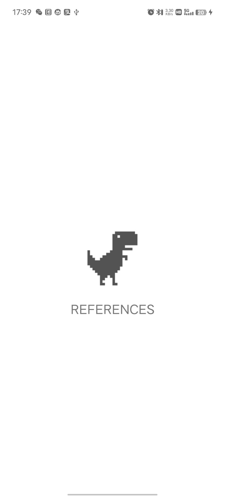

1、FitSystemWindows

```
android:fitsSystemWindows="true"

view.fitsSystemWindows = true
```

效果图（在当前的 viewGroup 上加 padding，自己可以塞东西到 status Bar 下实现适配）：

2、隐藏状态栏全屏显示

```
if (Build.VERSION.SDK_INT >= Build.VERSION_CODES.R) {
            window.insetsController?.hide(WindowInsets.Type.statusBars())
        } else {
            @Suppress("DEPRECATION")
            window.setFlags(
                WindowManager.LayoutParams.FLAG_FULLSCREEN,
                WindowManager.LayoutParams.FLAG_FULLSCREEN
            )
        }
```

效果：

刚打开时是这样的，之后就变成 和 fitSystemWindows 同样的效果